# RxCode

**A native macOS command center for AI coding agents.**

RxCode brings Claude Code, Codex, and Agent Client Protocol (ACP) clients into one SwiftUI workspace. It keeps the real agent runtimes underneath, but gives them a project-first desktop UI with streaming chat, permission approvals, Git context, run commands, natural-language search, mobile sync, and briefing views.


[](https://discord.gg/ytt8SjRRNN)

<p align="center">
  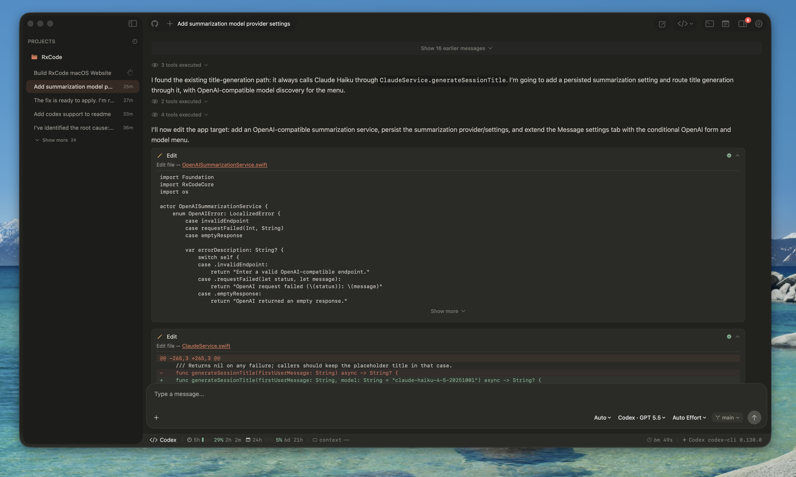
</p>

## Why RxCode

AI coding agents are powerful, but their best workflows are still scattered across terminal sessions, editor windows, branch checkouts, and chat history. RxCode keeps those pieces in one native Mac app:

- Choose Claude Code, Codex, or an ACP client per session.
- Run commands and project tasks without leaving the editor.
- Work with multiple agents at the same time, backed by Git worktrees.
- Search all sessions with natural language.
- Let Apple's Foundation Model handle lightweight local summarization tasks when available.
- Review what changed through a persistent briefing and change-tracking panel.
- Pair RxCode Mobile through end-to-end encrypted sync.

## Screenshots

| Workspace | Native macOS UI |
| --- | --- |
|  | 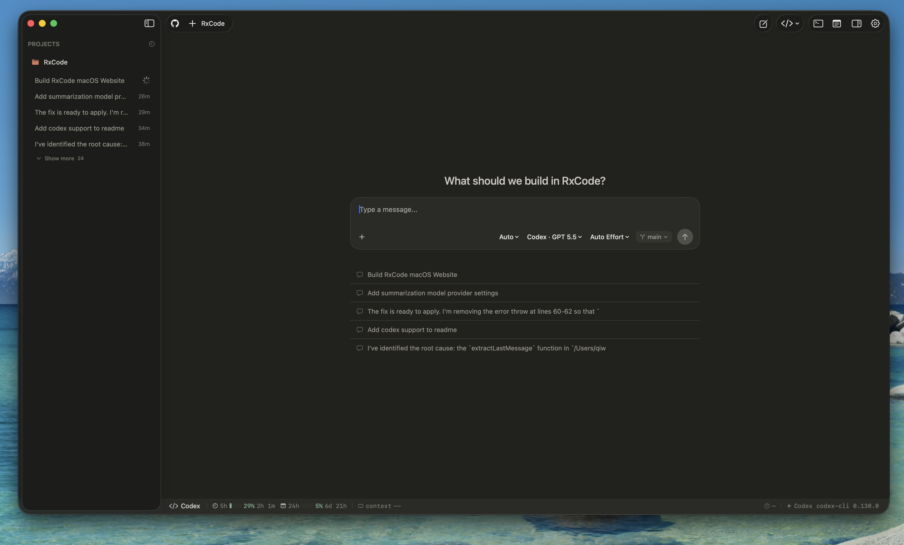 |

| ACP clients | Run commands |
| --- | --- |
| 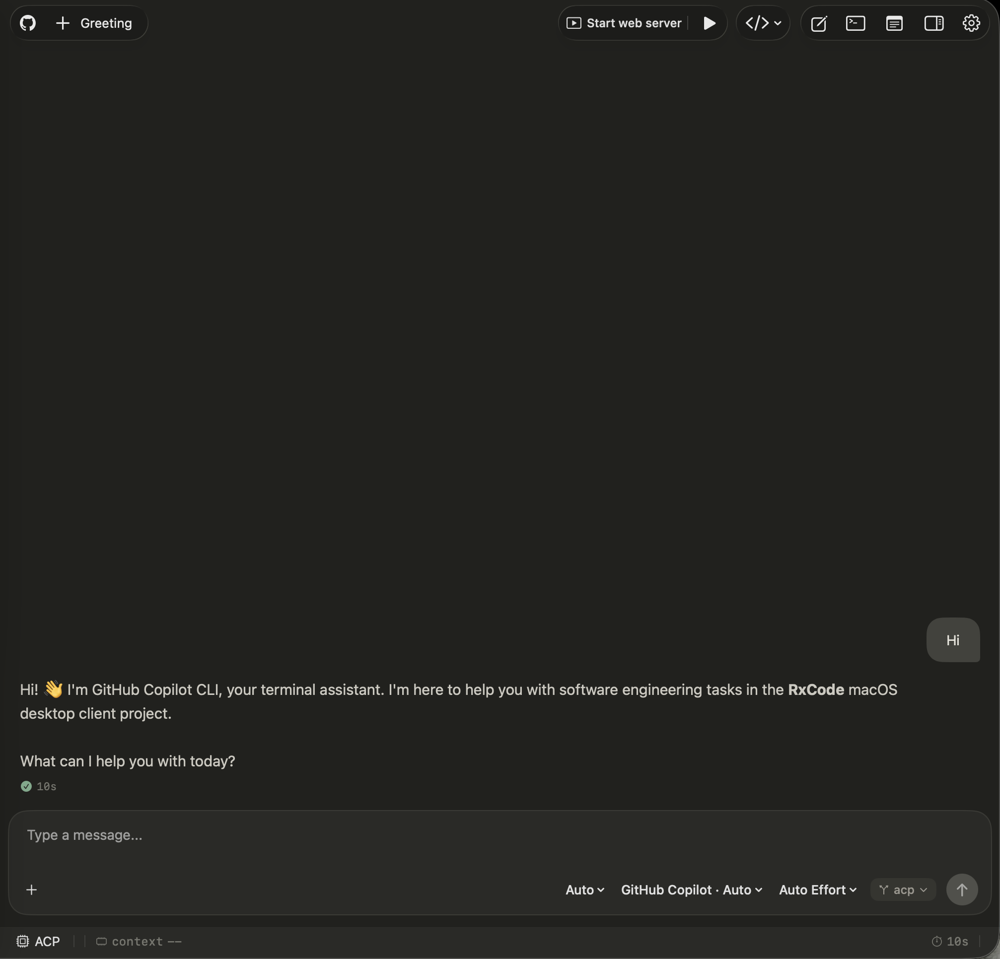 | 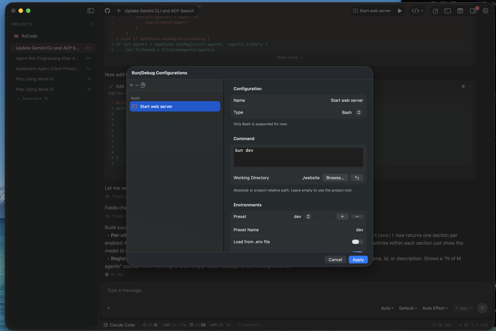 |

| Open in editor | Track changes |
| --- | --- |
| 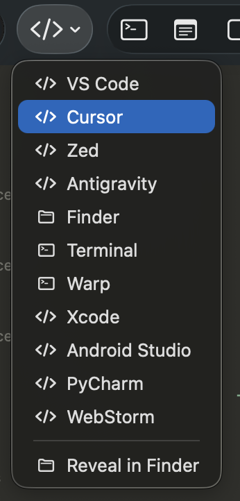 | 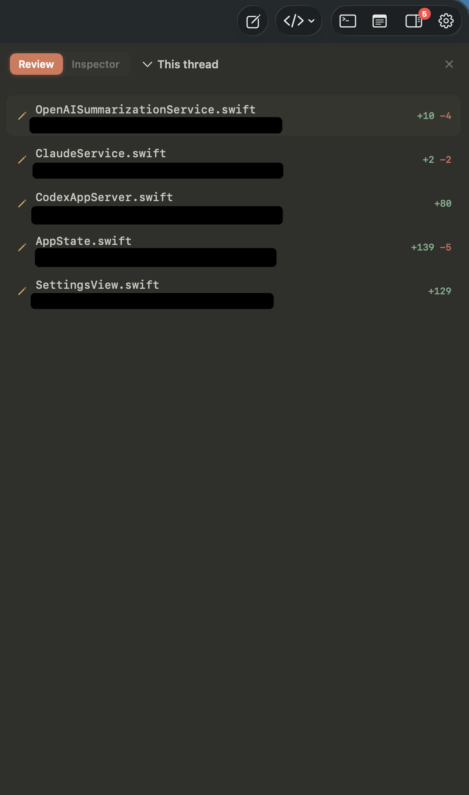 |

## Agent Runtime Support

RxCode supports both first-party CLI agents and ACP-compatible runtimes:

- **Claude Code**: stream chats, approve tools, inspect diffs, and keep Claude Code sessions attached to project history.
- **Codex**: run Codex in the same workspace with model, effort, permission, and usage controls.
- **OpenCode and more ACP clients**: install and run compatible clients such as OpenCode, Gemini CLI, and other registry agents.
- **Cursor and editor handoff**: open projects and files in Cursor, VS Code, Zed, Xcode, JetBrains IDEs, Finder, Terminal, or Warp.

<p align="center">
  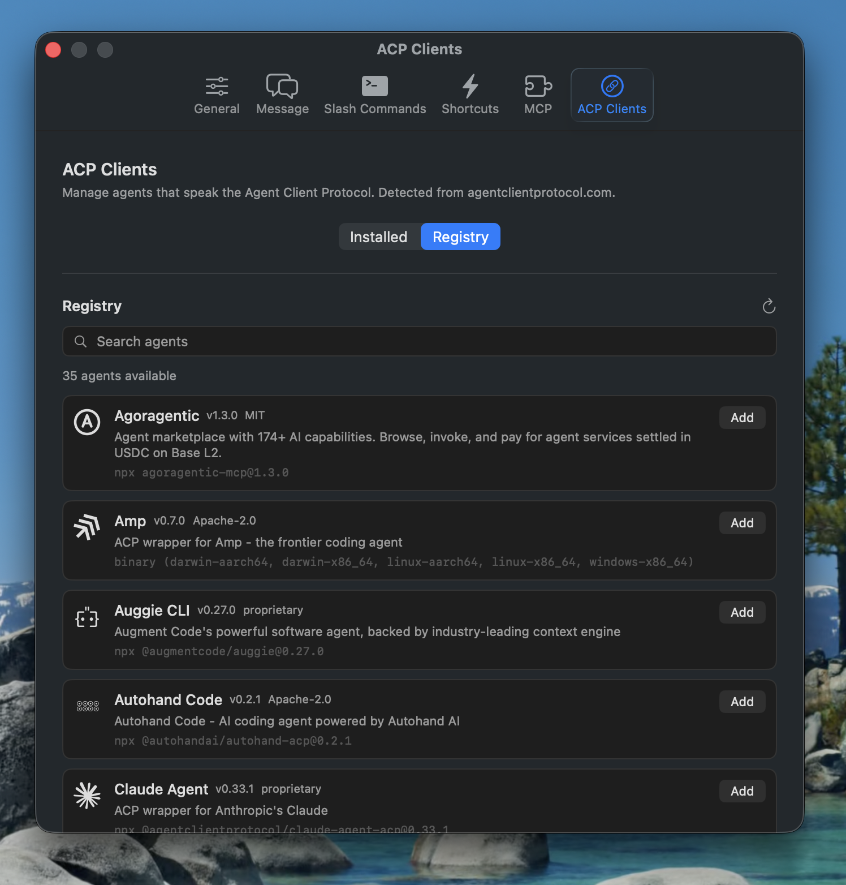
</p>

## Run Commands Inside RxCode

Run profiles let you keep repeatable project commands close to the chat. Define build, test, dev-server, or custom shell tasks, launch them from the toolbar, and inspect output inside RxCode instead of switching to a separate terminal.

The app also includes a SwiftTerm-powered terminal for interactive work, slash-command flows, and quick command shortcuts.

## Concurrent Chatting With Git Worktrees

RxCode is built for parallel agent work. You can open multiple project windows, keep streams running in the background, and attach sessions to Git worktrees so each agent can work on an isolated branch.

That makes it practical to ask one agent to update UI, another to fix tests, and another to inspect implementation details while the main repository stays readable.

## Natural-Language Global Search

Use the global search overlay to find prior agent work by meaning, not only by exact text. RxCode indexes local thread history on device, ranks results semantically, and can surface matching snippets from archived and active sessions.

## Local Lightweight AI With Apple Foundation Model

When Apple's Foundation Model is available, RxCode can use the local LLM for lightweight tasks such as session titles, response summaries, notification summaries, and commit-message suggestions. Larger coding turns still run through the selected agent runtime.

## Briefing And Change Tracking

The briefing section keeps you oriented when several sessions are moving at once. It summarizes what changed, keeps branch-level context visible, and pairs with the thread change panel so you can see files, additions, deletions, and session outcomes without reopening every chat.

<p align="center">
  
</p>

## Mobile App

RxCode Mobile mirrors the desktop workspace over an end-to-end encrypted sync channel and is designed to support the same core workflows as the desktop app. From your phone you can browse projects, search threads, start or follow agent sessions, review briefings, manage synced desktop context, and preview a website running on the host machine through the in-app browser.

| Projects | Search | New session |
| --- | --- | --- |
| 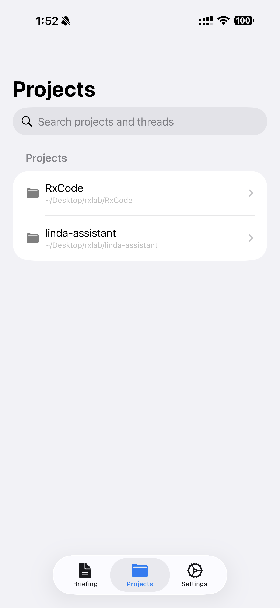 | 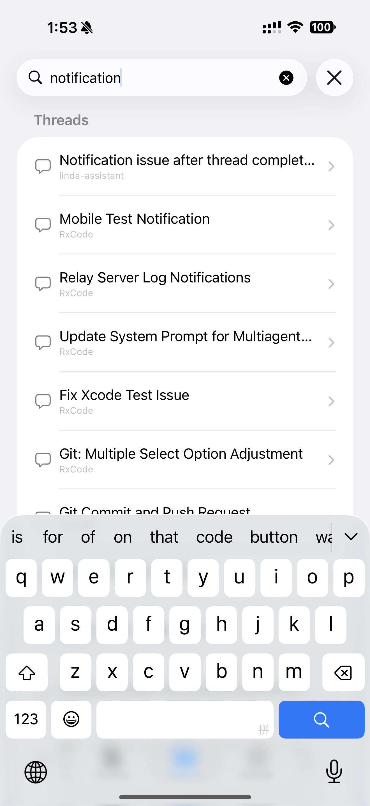 | 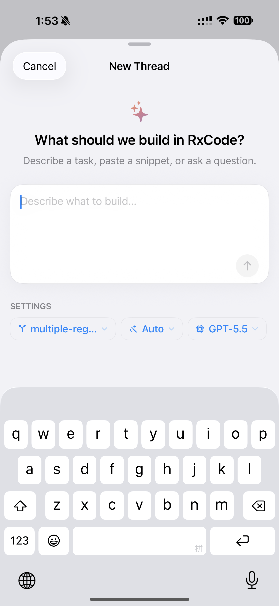 |

| Live chat | Host preview | Briefing |
| --- | --- | --- |
| 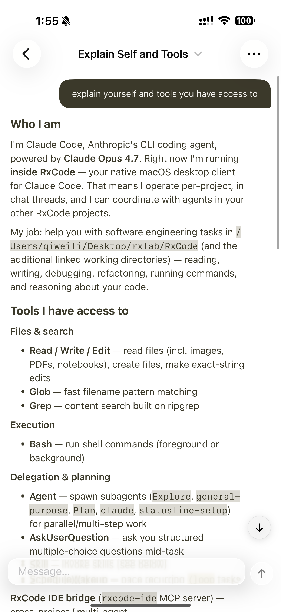 | 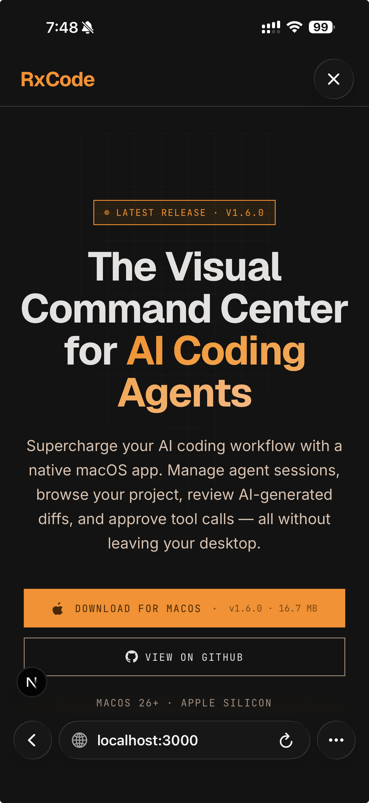 | 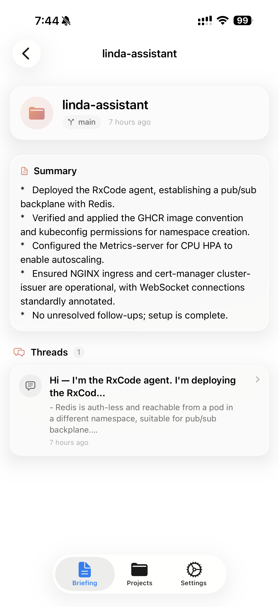 |

## Coming Soon: RxCoding Agent

RxCoding Agent is a planned UI-first coding agent built purely in Swift. It will use the endpoint you provide to code through RxCode's native interface, while keeping the app's project browser, permission flow, run profiles, briefings, and mobile sync as the control surface.

## More Features

| Feature | Description |
| --- | --- |
| **Permission approvals** | Risk-aware approvals for tool calls, with diff previews where available. |
| **MCP configuration** | Configure MCP servers for supported agents from Settings. |
| **GitHub integration** | OAuth device flow, Keychain token storage, SSH key management, repository browsing, and cloning. |
| **File explorer** | Browse files, preview content, edit files, inspect Git status, and insert paths into prompts. |
| **Session controls** | Choose agent, model, effort, and permission mode per session. |
| **Menu bar status** | Monitor active work and Claude Code or Codex usage without opening the main window. |
| **Shortcut buttons** | Save frequent prompts and terminal commands as one-click actions. |
| **Skill marketplace** | Browse and install compatible coding-agent skills from Settings. |
| **Themes and fonts** | Customize accent themes and interface or message font sizes. |

<p align="center">
  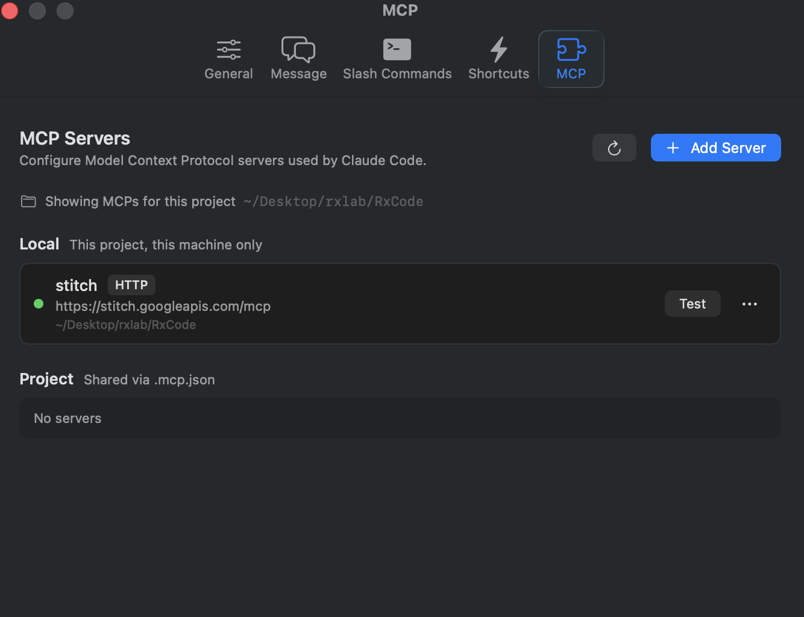
  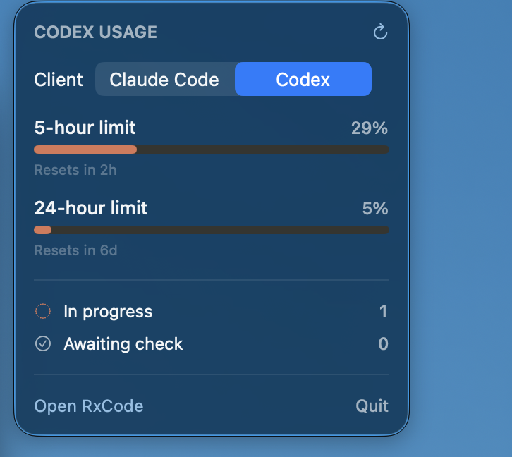
</p>

## Requirements

- macOS 26.0 or later
- At least one supported agent runtime:
  - [Claude Code CLI](https://docs.anthropic.com/en/docs/claude-code)
  - Codex CLI
  - An ACP-compatible client installed from Settings or configured externally
- Xcode with the Swift 6.2+ toolchain to build from source

## Installation

1. Download the latest RxCode release from [GitHub Releases](https://github.com/rxtech-lab/rxcode/releases).
2. Move `RxCode.app` to `Applications`.
3. Launch RxCode and connect your agent runtimes from Settings.

If macOS blocks the first launch, open **System Settings -> Privacy & Security** and choose **Open Anyway** for `RxCode.app`.

## Build From Source

Open the project in Xcode:

```bash
open RxCode.xcodeproj
```

Build from the command line:

```bash
xcodebuild -project RxCode.xcodeproj -scheme RxCode -configuration Debug build
```

Create a release build:

```bash
xcodebuild -project RxCode.xcodeproj -scheme RxCode -configuration Release build
```

## Project Structure

| Path | Purpose |
| --- | --- |
| `RxCode/` | macOS app target with SwiftUI views, services, resources, and integrations. |
| `Packages/Sources/RxCodeCore/` | Shared models, theme, utilities, sync protocol, and core logic. |
| `Packages/Sources/RxCodeChatKit/` | Reusable chat UI, message rendering, input bar, slash commands, shortcuts, diffs, and status line. |
| `RxCodeWidget/` | Widget and Live Activity surfaces for active work and usage. |
| `RxCodeTests/` | App-level XCTest coverage. |
| `Packages/Tests/` | Swift package tests. |
| `website/` | Public website and screenshot assets used by this README. |
| `scripts/` | Build, notarization, Sparkle signing, and release automation. |

## Community

Join the RxCode Discord to ask questions, share feedback, and follow development: [discord.gg/ytt8SjRRNN](https://discord.gg/ytt8SjRRNN).

## License

Apache License 2.0. See [LICENSE](LICENSE) for details.
